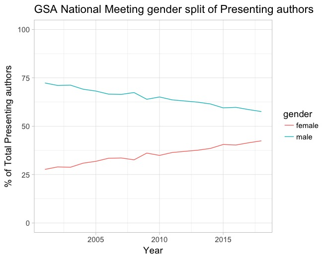

# Analysis of Gender for first authors on GSA presentations through time

I became interested in the concept of gender bias in different conferences through time. Especially looking at at who are the first authors at conference presentations. I decided to use R and the tidyverse to develope this question. This problem invited several challenges:
1. Web scraping of many different webpages (one for each abstract)
2. Inferring gender of first author from name (social security data)
3. plotting the results

To make a long story short, I found a distinct, positive, trend in terms of moving toward gender parity in first authorship. While the code was challenging to develop, the actual result is a bit simpler.

For more details you can see my two blog posts on this topic.

[Blog 1](https://matthewmorriss.weebly.com/codeblog/gender-split-at-gsa-2018)
[Blog 2](https://matthewmorriss.weebly.com/codeblog/gender-distribution-at-gsa-2003-2018)
